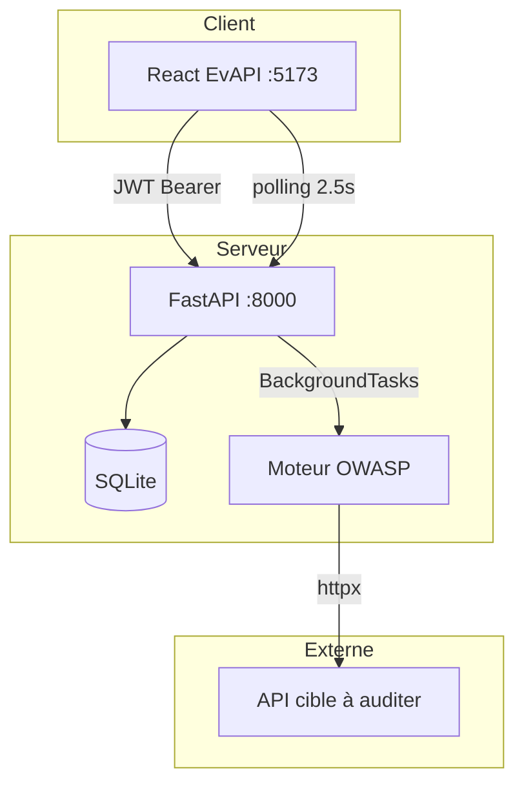

# EvAPI — Guide complet de A à Z

Plateforme d’audit de sécurité des APIs REST, inspirée de l’**OWASP API Security Top 10 (2023)**.

---

## A. Qu’est-ce qu’EvAPI ?

**EvAPI** (anciennement ScanAPI) est une application web qui :

1. Se connecte à une **URL d’API** que vous fournissez
2. Lance des **tests automatiques** (HTTPS, CORS, auth, injection, etc.)
3. Affiche un **score de sécurité** et une **liste de vulnérabilités**
4. Permet d’**exporter / importer** les rapports en JSON ou CSV

C’est un projet type **PFE / SaaS** : frontend React + backend FastAPI + base SQLite.

---

## B. Structure du projet

```
apiScanner/
├── scanner-api/              → Frontend React (interface utilisateur)
│   └── src/
│       ├── pages/            → Écrans (dashboard, scans, rapports…)
│       ├── context/          → État global (auth, scan en cours)
│       ├── components/       → UI réutilisable (sidebar, badges…)
│       └── utils/            → Appels API, export rapports
│
├── scanner-api-backend/      → Backend FastAPI (logique métier)
│   └── app/
│       ├── routers/          → Routes HTTP (auth, scans, reports…)
│       ├── models/           → Tables SQLAlchemy (User, Scan, Vuln…)
│       ├── services/         → Moteur de scan, export, stockage fichiers
│       └── core/             → Config, DB, sécurité JWT/bcrypt
│
├── docs/                     → Documentation (ce guide)
└── README.md                 → Démarrage rapide
```

---

## C. Technologies utilisées

| Couche | Technologie | Rôle |
|--------|-------------|------|
| Frontend | React 19 + Vite | Interface SPA |
| Routing | React Router 7 | Pages `/dashboard`, `/reports`… |
| Backend | FastAPI | API REST + Swagger `/docs` |
| ORM | SQLAlchemy 2 | Modèles et requêtes SQL |
| Base | SQLite (`scanapi.db`) | Données locales (dev) |
| Auth | JWT + bcrypt | Connexion sécurisée |
| HTTP scan | httpx (async) | Requêtes vers l’API cible |
| Tâches fond | FastAPI BackgroundTasks | Scan sans bloquer l’utilisateur |

---

## D. Architecture globale



**Flux principal :**

1. L’utilisateur se **connecte** → reçoit un token JWT
2. Il lance un **scan** → le backend crée un enregistrement `Scan` (status `pending`)
3. Le moteur tourne **en arrière-plan** et met à jour `progress` + `scan_logs`
4. Le frontend **interroge** `GET /scans/{id}/status` toutes les 2,5 s
5. À la fin → status `completed`, vulnérabilités en base, rapport affiché

---

## E. Base de données (modèles)

```
User (utilisateur)
  └── Scan (un audit sur une URL)
        ├── Vulnerability (chaque faille détectée)
        └── Report (synthèse : compteurs + score)
```

| Table | Champs importants |
|-------|-------------------|
| **users** | email, hashed_password (bcrypt), full_name |
| **scans** | target_url, scan_type, status, progress, score, scan_logs |
| **vulnerabilities** | owasp_category, title, severity, recommendation, endpoint |
| **reports** | critical_count, high_count…, security_score, duration_seconds |

**Sécurité BOLA :** chaque requête filtre par `owner_id` — un utilisateur ne voit que **ses** scans.

---

## F. Authentification

| Endpoint | Méthode | Description |
|----------|---------|-------------|
| `/api/v1/auth/register` | POST | Inscription + JWT immédiat |
| `/api/v1/auth/login` | POST | Connexion |
| `/api/v1/auth/me` | GET | Profil (token requis) |

- Mot de passe : min 8 car., 1 majuscule, 1 chiffre
- Token stocké dans `localStorage` (`access_token`)
- Header : `Authorization: Bearer <token>`

**Compte démo :**

```bash
cd scanner-api-backend
python scripts/seed_demo_user.py
```

→ `demo@evapi.com` / `Demo1234`

---

## G. Moteur de scan (OWASP)

Fichier : `app/services/scan_engine.py`

| Étape | % | Test |
|-------|---|------|
| Connectivité | 5 | L’URL répond-elle ? |
| HTTPS | 12 | Redirection HTTP → HTTPS |
| Headers sécurité | 25 | CSP, HSTS, X-Frame-Options… |
| CORS | 40 | Wildcard `*` dangereux |
| Auth | 52 | `/admin` accessible sans token |
| Rate limiting | 65 | 20 requêtes sans HTTP 429 |
| BOLA | 76 | Ressources `/users/1` sans auth |
| Injection SQL | 87 | Erreurs SQL dans la réponse |
| SSRF | 94 | Délai anormal sur URL interne |

**Score :** 100 − pénalités (critique −25, élevée −15, etc.)

---

## H. API REST (résumé)

### Scans

| Route | Description |
|-------|-------------|
| `POST /scans` | Lancer un scan (réponse 202) |
| `GET /scans` | Liste de mes scans |
| `GET /scans/{id}/status` | Polling (progress, logs) |
| `GET /scans/{id}` | Détail + vulnérabilités |
| `DELETE /scans/{id}` | Annuler |

### Rapports

| Route | Description |
|-------|-------------|
| `GET /reports` | Scans terminés |
| `GET /reports/{id}` | Rapport complet |
| `GET /reports/{id}/export?format=json\|csv` | Télécharger |
| `GET /reports/export/all` | Tous les rapports (JSON) |
| `POST /reports/import` | Importer un JSON |

### Autres

| Route | Description |
|-------|-------------|
| `GET /dashboard/stats` | Métriques tableau de bord |
| `GET /vulnerabilities` | Toutes les failles (filtres) |
| `PATCH /vulnerabilities/{id}` | Marquer résolue / ignorée |
| `POST /files/upload-spec` | Import OpenAPI (JSON/YAML) |

Documentation interactive : http://127.0.0.1:8000/docs

---

## I. Frontend — pages

| URL | Page | Rôle |
|-----|------|------|
| `/auth` | Connexion / inscription | Public |
| `/dashboard` | Tableau de bord | Stats live depuis l’API |
| `/scans/new` | Nouveau scan | Formulaire URL + checks |
| `/scans/progress` | Progression | Barre + logs en temps réel |
| `/reports` | Historique | Import / export |
| `/reports/:id` | Détail rapport | Vulnérabilités + export |
| `/vulnerabilities` | Liste globale | Filtres + statut |
| `/settings` | Paramètres | Profil (UI) |

**Contexts React :**

- `AuthContext` — user, login, logout, token
- `ScanContext` — scan courant, polling, historique

---

## J. Import / export des rapports

**Export JSON** — structure EvAPI :

```json
{
  "export_version": "1.0",
  "platform": "EvAPI",
  "scan": { "target_url": "...", "score": 72, "vulnerabilities": [...] },
  "report": { "critical_count": 1, ... }
}
```

**Export CSV** — une ligne par vulnérabilité.

**Import** — recrée un scan `completed` + vulnérabilités en base (archive, pas un re-scan réseau).

Code frontend : `src/utils/reports.js`

---

## K. Configuration (.env)

Copier `scanner-api-backend/EVAPI.txt` → `.env` :

| Variable | Exemple | Rôle |
|----------|---------|------|
| `DATABASE_URL` | `sqlite:///./scanapi.db` | Base de données |
| `SECRET_KEY` | clé longue aléatoire | Signature JWT |
| `ALLOWED_ORIGINS` | `http://localhost:5173` | CORS React |
| `ACCESS_TOKEN_EXPIRE_MINUTES` | `60` | Durée session |

---

## L. Démarrer le projet

**Terminal 1 — Backend**

```powershell
cd scanner-api-backend
.\venv\Scripts\activate
uvicorn app.main:app --reload --port 8000
```

**Terminal 2 — Frontend**

```powershell
cd scanner-api
npm run dev
```

→ http://localhost:5173

---

## M. Sauvegarder le projet (Git)

Git n’était pas installé sur la machine au moment de la doc. Pour versionner :

1. Installer [Git for Windows](https://git-scm.com/)
2. Dans le dossier `apiScanner` :

```powershell
git init
git add .
git commit -m "EvAPI: plateforme audit API OWASP complète"
```

**Déjà sauvegardé via OneDrive** — le chemin `OneDrive\Bureau\apiScanner` est synchronisé cloud si OneDrive est actif.

**Ne jamais commiter :** `.env`, `scanapi.db`, `venv/`, `node_modules/`

---

## N. Évolutions possibles

- Génération **PDF** des rapports
- **Ollama** pour recommandations IA (`ai_service.py`)
- Parser **OpenAPI** importé pour scanner tous les endpoints
- **PostgreSQL** + Alembic en production
- Respecter `selected_checks` dans le moteur (checks cochés dans l’UI)

---

## O. Fichiers clés à connaître

| Fichier | Pourquoi |
|---------|----------|
| `app/main.py` | Point d’entrée FastAPI |
| `app/services/scan_engine.py` | Cœur métier OWASP |
| `app/routers/reports.py` | Rapports + import/export |
| `src/router/index.jsx` | Routes React |
| `src/context/ScanContext.jsx` | Polling scan |
| `src/utils/api.js` | Client HTTP + JWT |

---

*Document généré pour le projet EvAPI — apiScanner.*
